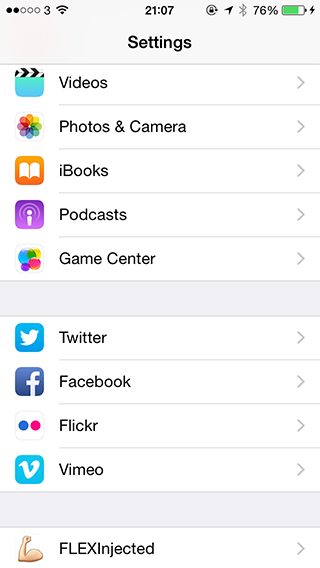
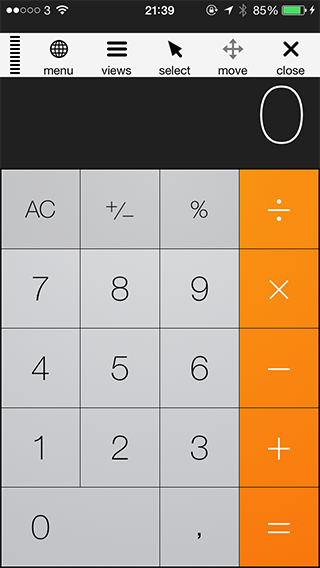

# FLEX injected
Injecting FLEX into 3rd party apps with MobileSubstrate

FLEX (Flipboard Explorer - https://github.com/Flipboard/FLEX) is a set of in-app debugging and exploration tools for iOS development.  FLEX is primarily intended to be a tool used in your own apps.  Want to learn how other apps are built? Just inject FLEX library into 3rd party apps and explore.

Requires a jailbroken iOS device.

Installation
------------

Most users should download the pre-compiled Debian package available under Releases.

### Dependencies

FLEX_injected was tested on iOS 8.1, but it should work on other iOS versions too. A jailbroken device
is required. Using Cydia make sure the following packages are installed:
- dpkg
- MobileSubstrate
- PreferenceLoader

### How to install

Most users should first download the latest pre-compiled Debian package available in the release section of the project page at: https://github.com/dtrukr/FLEX_injected/releases

The tool was tested on iOS8 running on an iPhone 5S.

Download and copy the Debian package to the device; install it:  

    dpkg -i com.daapps.FLEXInjected_0.0.1-1-11_iphoneos-arm.deb

Respring the device:

    killall -HUP SpringBoard

There should be a new menu in the device's Settings where you can
enable the extension:

Finally, choose and app that you want to inspect, kill and restart the App you want to inspect:

### How to uninstall

 dpkg -r com.daapps.FLEXInjected

Build
-----

Most users should just download and install the Debian package.
The build requires the Theos suite to be installed;
see http://www.iphonedevwiki.net/index.php/Theos/Getting_Started .
You first have to create a symlink to your theos installation:

    ln -s /opt/theos/ theos

Make sure dpkg is installed. If you have Homebrew, use:

    brew install dpkg

Then, the package can be built using:

	./make.sh
    make package
